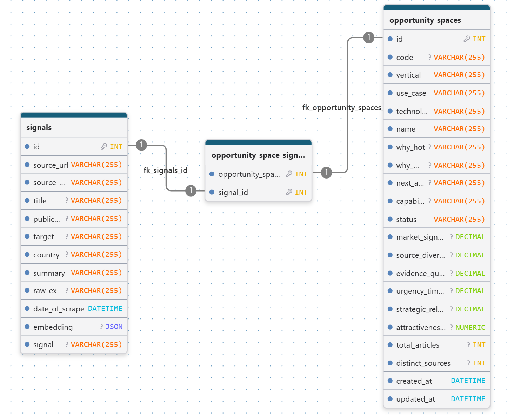

# 🟠 Innovation Radar — Orange Business

An automated competitive-intelligence pipeline that reads the open web for
telecom and IT news, groups related articles by meaning, and turns each group
into a scored, explainable **opportunity space** for Orange Business.

Built at BeCode (AI & Data Science bootcamp) over two weeks.

---

## What it produces

An opportunity space is always the same shape: **Vertical × Use case × Technology**.

> `Ports & Logistics × Automated port operations × Private 5G campus` — 76.1/100
>
> *Deutsche Telekom and Ericsson have deployed a live private 5G campus at the
> Port of Hamburg. Orange has strong private 5G industrial references (Port of
> Antwerp) but its proven port footprint is Belgium, so a rival now holds a
> marquee German port customer.*

Each one carries a headline attractiveness score, five sub-scores, a
why-now / why-it-matters narrative, a recommended next action, and a full trail
back to the articles it was built from.

---

## Quick start

```bash
git clone https://github.com/VictorCourtois135/innovation_radar_orange.git
cd innovation_radar_orange

python -m venv .venv && source .venv/bin/activate   # Windows: .venv\Scripts\activate
pip install -r requirements.txt

streamlit run app.py
```

The dashboard opens at `http://localhost:8501`.

**It runs with no configuration at all.** With no credentials it loads the CSV
snapshot in `data/` and says so in the sidebar. To read live data, create a
`.env` in the project root:

```env
SQL_SERVER=your-server.database.windows.net
SQL_DATABASE=your-database
SQL_USER=your-user
SQL_PASSWORD=your-password

AZURE_OPENAI_ENDPOINT=https://your-resource.openai.azure.com
AZURE_OPENAI_KEY=...
AZURE_OPENAI_EMBEDDING_DEPLOYMENT=text-embedding-3-large
AZURE_OPENAI_DEPLOYMENT=gpt-5-mini
AZURE_AI_PROJECT_ENDPOINT=...
AZURE_AI_AGENT_NAME=...
AZURE_AI_BUILDER_AGENT_NAME=opportunity-space-builder-agent
```

`.env` and `.streamlit/secrets.toml` are both git-ignored. Never commit either.

---

## Repository structure

```
app.py                            Streamlit entry point: page setup, sidebar, routing
radar/
  config.py                       colours, scoring weights, thresholds, column aliases
  data.py                         loads from Azure SQL, falls back to the CSV snapshot
  scoring.py                      the formula and its per-component breakdown
  personas.py                     Strategist / Sales / Presales filter presets
  theme.py                        Orange Business styling, shared Plotly layout
  views/
    radar_view.py                 the radar
    opportunities.py              ranked list
    detail.py                     one opportunity, and where its score came from
    signals.py                    raw signal explorer
    methodology.py                scoring, with live weight sliders
    how_it_works.py               pipeline, schema, caveats
scripts/
  run_agent_and_save.py           1. collect signals, embed, save
  opportunity_spaces.py           2. cluster, score, extract, merge, save
  scores.py                       scoring helpers used by the above
  generate_datail_summary.py      3. write a narrative overview per opportunity
  export_snapshot.py              4. dump the database to data/*.csv for deployment
source/
  source_registry.csv             canonical source names → credibility tier + type
data/
  snapshot_*.csv                  committed fallback data for the dashboard
```

---

## How the pipeline works

```
collection agent → signals table → clustering → capability check
                                                      ↓
     dashboard ← opportunity_spaces table ← scoring + extraction
```

### 1. Collection — the prompt logic

A single Azure AI Foundry agent with Bing grounding does the searching. The
prompt is built around five deliberate constraints, and each one exists to stop
a specific failure:

| Constraint | Why it is there |
|---|---|
| **Exclusion rule** — never cite `orange.com`, `orange.be`, `orange-business.com` or any Orange-branded release | A radar that reads Orange's own marketing would rediscover Orange's own roadmap and call it market intelligence. |
| **Platform balance** — mix national regulators (BIPT/IBPT, BEREC, Ofcom, FCC) with trade press and competitor coverage | Regulators publish decisions before the press covers them, and cannot be accused of hype. Trade press supplies the commercial reality regulators leave out. |
| **Uniqueness** — no duplicate articles or syndicated reprints | One press release republished by six outlets is one signal, not six. Without this, both source diversity and volume are inflated by the same story. |
| **Recency** — 2024 to 2026, weighted toward 2026 | Enterprise technology moves fast enough that a 2022 deployment is history, not a signal. |
| **Anti-hallucination** — return only what is verified, hard cap of 35 searches | Told to find exactly N sources, a model will invent the last few. Explicit permission to return fewer is what prevents that. The search cap keeps cost and runtime bounded. |

Findings must map to at least one target vertical: Industry & Manufacturing,
Retail & FMCG, IT Services & Cloud, Finance & Insurance, Automotive & Mobility,
Healthcare & Life Sciences, Energy & Utilities, Logistics & Transport, Public
Sector & Defense.

Output is strict JSON with no prose wrapper, so the next stage never has to
parse free text.

> **Known bias, stated openly:** what the radar finds is a function of what it
> was told to look for. Adding "cybersecurity" as a keyword produces more
> cybersecurity articles. The current prompt also explicitly excludes 5G topics
> and weights 2026 most heavily. This is a real limitation, not a bug, and it
> should be said out loud when presenting results.

### 2. Storage and deduplication

Each signal is inserted into `signals` after two duplicate checks: an exact
`source_url` match on insert, then a `source_name` + `title` sweep afterwards.

The **summary** is embedded with `text-embedding-3-large`, truncated to 1536
dimensions, stored as a native Azure SQL `VECTOR(1536)`. The summary rather than
the title (too short to carry meaning) or the body (too noisy).

### 3. Clustering — why one article is never an opportunity

Similarity runs as ordinary SQL using `VECTOR_DISTANCE('cosine', ...)`. Pairs
above **0.82** similarity form edges, a union-find builds connected components,
and only clusters of **3 or more** signals continue.

This is the core idea of the whole system. Independent sources converging on the
same theme is the actual evidence that something is happening. Two outlets
describing the same launch in different words land in the same cluster even with
no shared keywords, which keyword matching would miss entirely.

> **Consequence to be aware of:** the threshold is strict. 414 signals produced
> only 7 opportunity spaces. Eleven signals mention cybersecurity and none
> clustered, which is why there is no cybersecurity opportunity on the radar.
> That is a threshold choice, not an absence of cyber activity in the market.
> Both values live at the top of `scripts/opportunity_spaces.py`.

### 4. Capability check — the step that makes it useful

Before scoring, each cluster is compared against Orange's known deployed
capabilities, **including the geographic scope of each one**.

If Orange already sells this, in this market, the cluster is skipped and never
becomes an opportunity. Geography is what makes the check meaningful:

- Orange leads the Gartner Magic Quadrant for private 5G in **Europe and
  Africa**, so a European private-5G story is not an opportunity.
- Orange has **no network operator presence in the United States**, so the same
  story about a US carrier is a genuine market-entry question.

Without this step the radar would keep flagging Orange's own product catalogue
back at Orange as though it were a gap.

The agent is also asked to re-verify the capability snapshot against current web
information and flag any discrepancy in `capability_check_note` rather than
silently trusting a possibly outdated status.

---

## The scoring, parameter by parameter

```
attractiveness_score =
    0.30 × market_signal_strength
  + 0.20 × source_diversity_score
  + 0.15 × evidence_quality
  + 0.15 × urgency_time_horizon
  + 0.20 × strategic_relevance
```

All five are 0-100, so the result is too. **Four of the five are computed from
data. Only one asks the model.** That split is deliberate: reserve the LLM for
the single question that genuinely needs judgement, and compute everything else.

### 1. Market signal strength — 30% — code

How much noise the topic is making, from two independent measures:

- **Volume**: `100 × log(1 + articles) / log(1 + 10)`. A log curve, because
  going from 1 to 2 articles means far more than going from 9 to 10. Saturates
  near 10 articles.
- **Google Trends**: real search interest for the technology keyword over the
  last 12 months, via `pytrends`.

They are combined with **`max()`, not an average**. Google Trends is biased
toward consumer search terms and returns near-zero for precise B2B compounds
like "Private 5G + MEC". That near-zero reflects the term's specificity, not low
market interest, so averaging it in would unfairly punish exactly the technical
topics this radar exists to find. Values below 15 are treated as no-data and
ignored. Taking the max means a topic needs to be strong on **one** dimension,
press coverage *or* public search interest, to score well.

Trends results are cached for 7 days; a rate-limit response records a cooldown
and scoring falls back cleanly to volume only.

### 2. Source diversity — 20% — code

`distinct_sources / total_articles × 100`, computed **after** normalising
source-name variants through `source/source_registry.csv`, so "Deutsche Telekom
(media information)" and "Deutsche Telekom (telekom.com)" count as one source
and not two.

Ten articles from one outlet is weaker evidence than four articles from four
outlets. This is the score that captures that.

### 3. Evidence quality — 15% — code

Each source is matched to a credibility tier, the cluster's average tier is
taken, then converted:

```
evidence_quality = 100 − (average_tier − 1) × 25
```

| Tier | Source type | Examples | Score if all this tier |
|---|---|---|---|
| 1 | Regulators, wire services | BIPT, FCC, Ofcom, Reuters, Bloomberg | 100 |
| 2 | Paid analyst firms | Gartner, Omdia, GSMA | 75 |
| 3 | Specialised trade press | Light Reading, Fierce Network | 50 |
| 4 | Aggregators, press wires | BusinessWire, EuropaWire | 25 |
| 5 | Company-owned press releases | Vodafone Newsroom, AT&T Press | 0 |

A cluster of three press releases and one Reuters piece averages tier 4.0,
giving 25: mostly self-published, one independent source.

This score is deliberately narrow. It measures **credibility only**, not how
many sources there are (that is diversity) or how recent they are (that is
urgency). A competitor's own press release is a perfectly valid signal worth
collecting; it just carries an inherent incentive to embellish that a regulator
does not. That reliability gap is all this number represents.

**The registry grows by itself.** An unrecognised source triggers one
classification call and the result is appended to the CSV permanently, so it is
never reclassified again.

### 4. Urgency / time horizon — 15% — code

Average recency of the cluster's signals, using **continuous exponential decay**
with a 270-day half-life:

```
score = 100 × 0.5 ^ (age_days / 270)      floored at 5
```

Published today ≈ 100, nine months ≈ 50, eighteen months ≈ 25. Continuous rather
than step buckets, so two signals a month apart are actually distinguishable. An
earlier design asked the LLM to guess this value; recency is fully determinable
from data, so no judgement call is needed.

This also drives the radar's **Now / Next / Later** rings (≥66, ≥33, below).

> Naming note: the field is called `novelty_momentum` in the older CSV export and
> `urgency_time_horizon` in the database. Same computation. `radar/data.py`
> resolves the alias so nothing downstream has to care.

### 5. Strategic relevance — 20% — LLM judgement

The one genuinely qualitative question: does this matter to Orange beyond what
volume, recency and source quality already say?

The agent is grounded in Orange's actual stated plan (**"Trust the Future"
2026-2030**, whose "Growth through Innovation" ambition names cybersecurity,
trusted cloud, AI and B2B services as explicit targets) rather than general
business intuition.

- Matches a named strategic priority → 70-90+
- Good enterprise-connectivity fit, outside the named pillars → 50-70
- Areas Orange has exited or has no footprint in → below 50

Scoring is deliberately conservative: 90+ should be rare, most real
opportunities land in 40-75.

### Near-duplicate merging

After extraction, opportunities are compared pairwise on name similarity (≥0.6)
and `why_matters` similarity (≥0.55) and merged when they describe the same
underlying question. This happens when two separate signal clusters, often about
two different competitors, converge on one strategic point. The merged row keeps
the highest score and the union of all contributing signal IDs.

---

## The dashboard

Six pages, all reading the same data:

| Page | What it answers |
|---|---|
| **Radar** | Where are the opportunities, by vertical and urgency? |
| **Top opportunities** | What are the strongest few, ranked? |
| **Opportunity detail** | What is this one, and **exactly where did its score come from**? |
| **Signal explorer** | What raw evidence exists, by country, type, source and month? |
| **Scoring methodology** | How is the score built, and does the ranking survive different weights? |
| **How it works** | What is the pipeline, the schema, and what should I be careful about? |

**The detail page is the important one.** The project's acceptance criteria say
the scoring model must not produce only a number, it must explain the number:
*"if a user cannot explain why a topic is ranked, the scoring is not good
enough."* So that page breaks the score into the five weighted amounts that sum
to it, marks which came from code and which from the model, and lists every
supporting article with a link.

### Design decisions worth knowing

**No categorical colour palette anywhere.** Every chart is a single-hue orange
ramp (magnitude), one flat orange (single series), or recessive grey. Two
reasons: `status` — the obvious thing to colour by — is NULL on every row the
pipeline writes, so colouring by it produced one flat grey chart that looked
broken; and a single-hue ramp is read by *lightness*, so it stays legible under
every form of colour-vision deficiency and in greyscale print. Where two kinds of
thing must be told apart (code-computed versus LLM-judged sub-scores), that is
carried by a text label and an icon, never by colour.

**The app never shows a blank screen.** `radar/data.py` reads `st.secrets`, then
environment variables, then the CSV snapshot. A missing credential produces a
sidebar message, not a crash on import. Azure SQL serverless auto-pauses and
takes 30-60 seconds to wake, so connection is retried three times at 15 seconds
and then falls back to the snapshot rather than leaving a demo staring at
nothing.

**Embeddings are never queried by the dashboard.** Columns are listed explicitly
instead of `SELECT *`, because the `VECTOR(1536)` column would pull over 600,000
floats across the network on every cache refresh for no benefit.

---

## Running the pipeline

Order matters. Each step depends on the one before it.

```bash
python scripts/run_agent_and_save.py        # 1. collect + embed + save signals
python scripts/opportunity_spaces.py        # 2. cluster + score + extract
python scripts/generate_datail_summary.py   # 3. narrative overview per opportunity
python scripts/export_snapshot.py           # 4. refresh data/*.csv, then commit
```

Steps 3 and 4 are safe to re-run. Step 3 only fills rows where
`detailed_summary IS NULL`; step 4 just overwrites the CSVs.

---

## Deployment

**Streamlit Community Cloud** is the simplest route, with one caveat that decides
the approach: it cannot install Microsoft's ODBC Driver 18, which `pyodbc`
requires, and its outbound IPs are not fixed, so reaching Azure SQL from there
would mean opening a very wide range on the SQL firewall of a shared team
account.

So the intended deployment is **snapshot-based**:

1. `python scripts/export_snapshot.py`
2. `git add data/ && git commit -m "Refresh dashboard snapshot" && git push`
3. Point Streamlit Community Cloud at the repo, main file `app.py`

The deployed app reads the committed CSVs, needs no credentials and no firewall
change, and updates whenever you push a fresh snapshot.

**Azure App Service** is the alternative if live data in the browser is a
requirement: `pyodbc` works there, the firewall stays tight, and you set the four
`SQL_*` values as application settings.

**Locally**, put the credentials in `.env` and the app reads live data directly.

---

## Database schema



| Table | Holds |
|---|---|
| `signals` | One row per article: source, title, publication date, country, summary, signal type, and the 1536-dimension embedding. |
| `opportunity_spaces` | One row per synthesised opportunity: the three-part identity, narrative fields, five sub-scores, headline score, evidence counts. |
| `opportunity_space_signals` | Join table. This is the traceability: every score walks back to the exact articles behind it. |

---

## Known limitations

Stated plainly, because a radar nobody can question is a radar nobody should
trust.

- **Volume measures what the agent found**, not total market activity. A capped
  number of searches means a topic it did not search for scores low regardless of
  how hot it actually is.
- **The credibility tiers are a judgement.** Deciding Gartner is tier 2 and Light
  Reading is tier 3 was a team decision, not a fact. Worth revisiting together
  rather than treating the registry as settled truth.
- **Strategic relevance is one model call**, and it is 20% of the headline
  number. Grounded in Orange's stated plan, but still a single opinion.
- **`status` is never written.** The column exists and the dashboard reads it,
  but nothing in the pipeline populates it, so every row shows as *unclassified*.
  Promoting an opportunity to a watchlist does not persist yet.
- **Personas are filter presets, not model tags.** The original design had an
  `opportunity_space_personas` table with an LLM judgement per opportunity. It did
  not survive the move from PostgreSQL to Azure SQL. The three sidebar presets
  approximate the audiences using existing columns and the UI says so.
- **`country` lives on `signals`, not on `opportunity_spaces`.** Markets shown
  for an opportunity are rolled up through the join table, so one backed by
  articles about three countries lists three.
- **The model occasionally refuses a cluster** or returns malformed JSON, most
  often over-escaped apostrophes. Both are caught and logged as clean skips with
  a reason rather than crashing the run.

---

## What we would build next

1. **Persist personas properly** — add the join table, extend the builder agent's
   prompt to tag each opportunity, re-run. This turns the presets into the real
   feature.
2. **Write `status`** so the watchlist survives a page reload.
3. **Add `country` to `opportunity_spaces`** at extraction time instead of
   deriving it, so it can be filtered efficiently.
4. **Patent and funding counts** (WIPO, Crunchbase) as a third, harder economic
   input to market signal strength.
5. **Revisit the clustering threshold.** 0.82 with a 3-signal minimum is
   currently costing real topics, cybersecurity most visibly.
6. **CodeCarbon** to track the pipeline's emissions.

---

## Is any of this Orange-specific?

Mostly no, and that is the point.

**Reusable as-is for any organisation:** the collect → embed → cluster → score →
explain pipeline, the source credibility registry, the recency decay, the
diversity ratio, the near-duplicate merging, and the entire dashboard.

**Orange-specific, and swappable:** the competitor list, the target verticals,
the capability inventory used by the skip logic, and the strategic priorities
that ground `strategic_relevance`. Replace those four inputs and the same system
runs for a different company.

The genuinely transferable idea is the **capability-aware skip**: an opportunity
radar is only useful if it knows what its owner can already do. Everything else
is a well-built news pipeline.

---

## Team

BeCode AI & Data Science bootcamp, two-week project.

- [Gunay Bayramova](https://github.com/Gunay-Bayramova) — team lead
- [Victor Courtois](https://github.com/VictorCourtois135) — repo manager / tech lead
- [Mahalakshmi Palanivel](https://github.com/mahalakshmip1604) — data architect / tech lead
- [Anna Diacofotaki](https://github.com/anna-diaco) — documentation specialist
