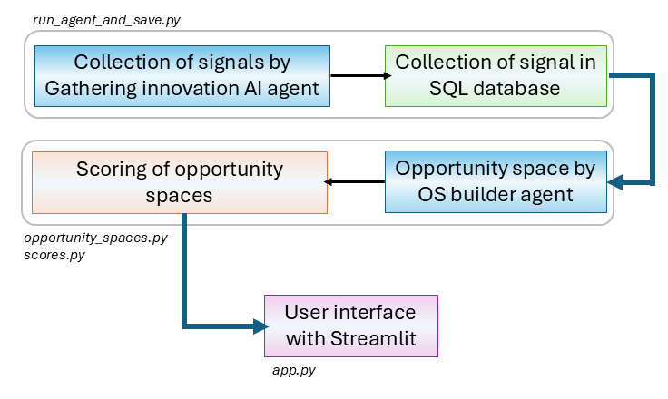
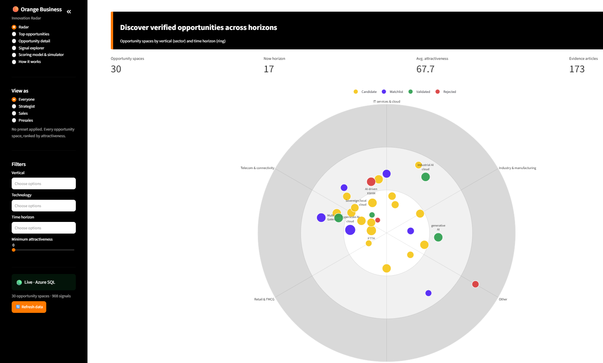
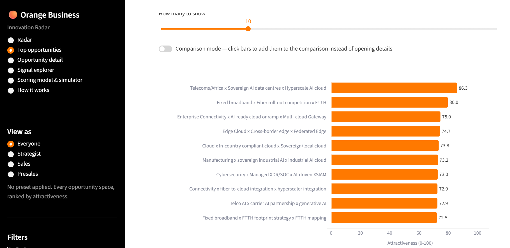

# 🤖 Innovation Signal Monitoring & Competitive Intelligence  Agent

## 📄 Brief description

This is an Orange Business challenge undertaken at the Becode-data science and AI bootcamp. The mission is to create an innovation radar, where Orange Business can quickly evaluate emerging opportunity spaces (OS) in areas of strategic interest to get an informed decision on whether to pursue them. This tool is designed for three main target groups for our client:

- strategists and innovators
- sales team
- presales and proposal teams

## 🎯 Core objectives & methodology

### a. Objectives

We structure our Orange Business mission with the following objectives:

1. Automate collection of publicly available market insights to pinpoint emerging cutting-edge technologies, deployments of new infrastructures, and advances of Orange Business competitors. We focus on both specific tech websites and de novo sites found by the agent in line with strategic priorities of Orange Business.
2. Store these information into an sql database (db) on Azure.
3. Generate OS from the scraped information.
4. Generate a score for each OS to provide a hierarchy of priorities for Orange Business.
5. Create a customized user interface for the target groups to explore the OS.

### b. Methodology

1. We used a Microsoft foundry AI agent (gathering innovation agent) to crawl and extract structured market signals from the open web including customized specialized tech websites, according to Orange Business key interests (i.e., global and regional telecommunications and IT sectors). The prompt we used can be viewed in the "Prompts" folder. We would like to note the following:

- the agent is forced to capture unique signals (distinct editorial outputs)
- a cap of 30 signals per run has been imposed
- clients strategic interests include: cloud infrastructure, cybersecurity, finance, manufacturing, public services, AI, data intelligence, and IoT, collaboration, etc.
- we search for Orange Business competitors updates
- we explicitely monitor for signals from 2024 onwards (prior to that, given the speed of technology innovation, we consider the signals outdated).
- limit hallucinations: if the agent cannot meet the criteria we gave for the number of output, it stops and returns only the number of signals it retrieved for that particular run.
- to have a wide variety of sources and signals, since we run the agent multiple times per day, we customized the prompt not to capture duplicates (for eg, in the downstream runs we defined new keywords related to Orange business, or new countries where signals are sourced from).

2. Using a python script, we called the AI agent and stored the output into an SQL database hosted on Azure.
3. We used a Microsoft foundry AI agent to create OS from Orange Business based on their areas of interest. Prompt can be viewed in "Prompts" folder.
4. Using a python script, we computed an attractiveness score as follows:
   a) each signal was embedded
   b) cosine similarity is computed for each signal with the other signals
   c) if three or more signals have a cosine similarity > 0.82, they are considered an opportunity space.
   d) for each space, an attractiveness score is calculated ("see below attractiveness score").
5. We used Streamlit to create an interactive web-based user interface (access through a local web browser; see below).

## 🛕 Project architecture



*Fig1: Schematic representation of our pipeline*

## 🛠️ Tech stack

| Tool                   | Function                         |
| ---------------------- | -------------------------------- |
| Python                 | Programming language             |
| SQL                    | db type                          |
| drawDB                 | db schema                        |
| Azure                  | cloud computing                  |
| AI foundry agent       | AI agent                         |
| GPT5-mini              | LLM                              |
| text-embedding-3-large | embedding                        |
| pytrends               | python library for google trends |
| Streamlit              | User interface                   |
| Git/github             | version control                  |

## 📁 Repo structure

## 💻 Installation

**1. Clone the repo**

```
git clone https://github.com/VictorCourtois135/innovation_radar_orange.git
cd innovation_radar_orange
```

**2. Create a virtual environment**

```
python3 -m venv .venv
source .venv/bin/activate
```

**3. Install dependencies**

```
pip install -r requirements.txt
```

**4. Open user interface** :

```
streamlit run app.py
```

The app should open automatically at `http://localhost:8501`.

## 📊 Standardized Data Output

### 1. Database structure


*Fig2: We generated three tables: one containing the articles, one with the opportunity space and a table connecting the two*

### 2. Innovation radar

The application of the innovation radar opens as the following view:



1. On the left, you can find the navigation sidebar where you can:

- move to different pages (radar, top opportunities etc.)
- for each of these pages, you can have a view as the persona of interest: strategist, sales and presales, or all of them combined (i.e., everyone)
- you can also apply different filters in the pages such as a vertical or technology of interest, the time you want to act on the OS of interest, or a minimum attractiveness score
- the "live" icon indicates if you are connected to the Azure db; if credentials are missing, or the Azure firewall blocks the connection, or the db is unavailable, you will see a CSV snapshot.
- if you choose to update the db, you can refresh the app using the "refresh data" at the bottom

2. On the main view of the each page, you can find the plots of interest with a detail explanation of graphs and their sources.
   The screenshot above shows the "radar" page. You can see the radar depicted as concentric circles:

- the smaller the circle, the more priority to act on the OS has to be given
- the lines intersecting the circles represent the verticals of interest
- the bubles on the circles represent the OS that were identified. The smaller the bubble, the lower their attractiveness scores
- the color of the bubles indicate the status of the OS: all OS are identified as "candidates" by our radar. Then, the user has the choice to classify them as: watchlist, validated or rejected.
- for  clarity, only the name of the top 10 OS are depicted on the radar.

3. On the "Top opportunities" page, you can view the opportunities in detail. They are named as follows:
   vertical x usecase x technology



* If you select one of them, the redirects you to the page "opportunity detail" where you can view in detail how the opportunity was obtained. This includes detailed **'Overview',  'Why this is hot now',  'Why it matters to Orange', 'Recommended next action', 'Capability check' and 'Supporting signals' .** 


## 💡 Attractiveness score for each OS and Scoring model simulator

We computed a different scores (0 to 100)for each OS to determine how attractive it is for Orange Business based on the following criteria:

**1. signal market**: the maximum number of signals in one of the following:

- volume: number of collected signals in the cluster on a logarithmic curve
- google trends: real public search interest for the technology keyword over the last 12 months (via pytrends). Values below a noise floor of 15 are ignored entirely.

**2. source diversity**: the number of distinct sources divided by the number of signals (x100).

**3. evidence quality**: based on the source of the article, we attribute a rank. Each signal's source is matched to a 1–5 tier in source_registry.csv as follows:

- regulators, wire services: 100
- paid analyst firms: 75
- specialized trade press: 50
- aggregators, wire distribution: 25
- compant owned press releases: 0
  The cluster's average tier is converted to a 0–100 score as follows: 100 − (average_tier − 1) × 25.

**4. urgency**: we take the date of each publication in the cluster and convert it to a score (continuous exponential decay, i.e., 100: publication from today, 50: publication from 9 months ago). Then we average the scores for each cluster.

**5. strategic relevance**: this is the only metric done by LLM; it is a judgment call that cannot be computed by data. It answers to the the question "does it matter to Orange Business". A score is attributed as follows:

- 70-90+: corresponds to a known strategic priority
- 50-70: good fit for Orange Business, outside the known pillars but connected with their overall entreprise vision
- <50: a field that Orange Business has exited or has never invested before.

For each of these scores, a weight is attributed and they are summed as in the formula below, to compute the final attractiveness score:


These scores were suggested by the client. In our app, we also give the power to the user to change the weight of the scores based on the signal they are interested in the most.


## ✅ Accuracy of results

1. Traceability: every opportunity space is linked to its exact source signals.
2. Attractiveness score is clear: four of the sub score can be clearly understood and reproduced based on the data.
3. Freshness check: before relying on a capability claim, the agent re-verifies it against current web sources and flags discrepancies rather than trusting a static snapshot silently.
4. Dashboard tool: we can check every output and recompute the attractiveness score based on the weights we chose.

## 💫 Top 5 unique features of our radar

1. Before any signal becomes an "opportunity," it's checked against a researched (not hallucinated) document of Orange's actual deployed capabilities, including geographic scope. If Orange already does it in that market, it's skipped — the radar surfaces genuine gaps, not noise.
2. The attractiveness score is computed by four metrics directly from the data we collected. Only the strategic relevance is an LLM judment call. Therefore, it is mostly a deterministic score. The weight of the LLM can also be nulled (see point 3) by the user.
3. The final attractiveness score can be modified by customed weights by the user based on the signal of interest.
4. All signals that were used to generate the opportunity space are available (URLs). We also have a "capability check note" that documents what the LLM verified before it created the OS.
5. The user can classify a "candidate" OS as "watchlist", "rejected" or "validated".

## 🔍 Limitations and future outlooks

1. Our pipeline is based on a prompt that gathers the signals based on keywords we extracted from the client's presentation, and the information we found online about their business. To make the prompt even stronger, we recommend that the client introduces their own strategic keywords based on their internal information.
2. Our scripts are run manually. Going forward, we would suggest to automate this process and schedule a monthly update - we consider that a timeline of a month is a nice balance between noise information and upcoming market trend.
3. We will implement an action plan to orient Orange Business on whether they need to pursue or not the OS.
4. The OS identified are country-agnostic. Before the client decides to pursue one, they need to be informed about the local regulations for this implementation to occur.

## ⚔️ Challenges

During the implementation of the project, we faced the following challenges:

1. Prompt-related:

- time contraint for signal collection: we capped to 30 signals per run; it was the sweetspot we determined to have a large number of signals in a reasonable amount of time (<10min per run).
- keyword optimization for each run to cover all the innovative topics, in a wide variety of countries and the competitors based on the results of the previous prompt.

2. Cost-related: we carried our project with the Azure student subscription. We implemented a balance between the number of new keywords to introduce, number of runs of both the gathering and the opportunity agent to stay within our alocated budget.
3. Scoring-related: develop a method to compute the scoring based on the data metrics alone, limiting as much as possible the use of LLM.

## ⌛Timeline

This project was completed in two weeks.

## 🔦 Credits

The innovation radar was set up by the members of our team at Becode - data science and AI bootcamp:

- [Gunay Bayramova](https://github.com/Gunay-Bayramova) : team lead
- [Victor Courtois](https://github.com/VictorCourtois135) : repo manager/tech lead
- [Mahalakshmi Palanivel](https://github.com/mahalakshmip1604): data architect/tech lead
- [Anna Diacofotaki](https://github.com/anna-diaco): documentation specialist
