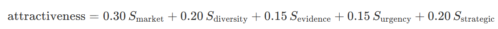

# 🤖 Innovation Signal Monitoring & Competitive Intelligence  Agent

## 📄 Brief description

This is an Orange Business challenge undertaken at the Becode-data science and AI bootcamp. The mission is to create an innovation radar, where Orange Business can quickly evaluate emerging opportunity spaces in areas of strategic interest to get an informed decision on whether to pursue them. This tool is designed for three main target groups: 
- strategists and innovators
- sales team
- presales and proposal teams


## 🎯 Core objectives & methodology 

### a. Objectives 

We structure our Orange Business mission with the following objectives: 
1. Automate collection of publicly available market insights to pinpoint emerging cutting-edge technologies, deployments of new infrastructures, advances of Orange Business competitors. We focus on both specific tech websites and de novo sites found by the agent in line with strategic priorities of Orange Business. 
2. Store these information into an sql database (db) on Azure
3. Generate opportunity spaces (OS) from the scraped information 
4. Generate a score for each OS to provide a hierarchy of priorities for Orange Business. 
5. Create a customized user interface for the target groups to explore the OS


### b. Methodology

1. We used a Microsoft foundry AI agent (gathering innovation agent) to crawl and extract structured market signals from the open web including customized specialized tech websites, according to Orange Business key interests (i.e., global and regional telecommunications and IT sectors). Prompt can be viewed in "Prompts" folder. We would like to note the following: 
- the agent is forced to capture unique signals (distinct editorial outputs)
- cap of 30 signals per run
- strategic interests: cloud infrastructure, cybersecurity, finance, manufacturing, public services, AI, data intelligence, and IoT, collaboration, etc.
- highlight the signals from Orange Business competitors
- we explicitely monitor for signals from 2024 onwards (prior to that, given the speed of technology innovation, we consider the signals outdated).
- limit hallucinations: if the agent cannot meet the criteria we gave for the number of output, it stops and returns only the number of signals it retrieved for that particular run.
- to have a wide variety of sources and signals, since we run the agent multiple times per day, we slightly modified the prompt not to capture duplicates (for eg, in the following runs we defined new keywords related to Orange business, or new countries where signals are sourced from > highly customizable prompt based on needs)
2. Using a python script, we called the AI agent and stored the output into an SQL database hosted on Azure.
3. We used a Microsoft foundry AI agent to create OS from Orange Business based on their areas of interest. 
4. Using the above agent, we computed a score for each OS with the following considerations:
-
-
-
Prompt can be viewed in "Prompts" folder.
5. We used Streamlit to create an interactive web-based user interface (access through a local web browser). 


---

## 🛕 Project architecture


*Schematic representation of our pipeline*


## 🛠️ Tech stack 

|Tool               |       Function        |
|-------------------|-----------------------|
|Python             | Programming language  |
|SQL                | db type               |
|drawDB             | db schema             |
|Azure              | cloud computing       |
|AI foundry agent   | AI agent              |
|GPT5-mini          |   LLM                 |
|text-embedding-3-large |embedding          |
|pytrends           | python library for google trends |
|Streamlit          |  User interface       |
|Git/github         | version control       |


## 📁 Repo structure


## 💻 Installation 


**Open user interface** : 

``` 
streamlit run app.py 
```


---

## 📊 Standardized Data Output

To feed seamlessly into downstream relational databases, automated innovation radars, or enterprise business intelligence dashboards, the agent bypasses all conversational chat commentary or markdown formatting wrappers. It outputs **ONLY** a single, raw, valid JSON object following this strict schema:

```json
{
  "signals": [
    {
      "id": 1,
      "source_url": "https://example-telecom-press.com",
      "source_name": "Publication or Regulator Name",
      "title": "Exact Title of the Published Article or Official Document",
      "publication_date": "2026-08-14",
      "targeted_vertical": "Industry & Manufacturing",
      "country": "Belgium",
      "summary": "A granular, cohesive 3-5 sentence analytical breakdown detailing the technology deployed, the competitive impact, and the strategic positioning of the operator within that regional vertical market.",
      "raw_excerpt": "Direct verbatim quote or key structural excerpt harvested from the source string to verify authenticity (Max 300 characters)."
    }
  ]
}
```


## 🎡 Database structure

*We generated three tables: one containing the articles, one with the opportunity space and a table connecting the two*


## 💡 Attractiveness score for each OS 
We computed a different scores (0 to 100)for each OS to determine how attractive it is for Orange Business based on the following criteria:

**1. signal market**: the maximum number of signals in one of the following:
- volume: number of collected signals in the cluster on a logarithmic curve
- google trends: real public search interest for the technology keyword over the last 12 months (via pytrends). Values below a noise floor of 15 are ignored entirely.

**2. source diversity**: the number of distinct sources divided by the number of signals (x100).

**3. evidence quality**: based on the source of the article, we attribute a rank. Each signal's source is matched to a 1–5 tier in source_registry.csv as follows: 
- regulators, wire services: 100
- paid analyst firms: 75
- specialized trade press: 50
- aggregators, wire distribution: 25
- compant owned press releases: 0
The cluster's average tier is converted to a 0–100 score as follows: 100 − (average_tier − 1) × 25.

**4. urgency**: we take the date of each publication in the cluster and convert it to a score (continuous exponential decay, i.e., 100: publication from today, 50: publication from 9 months ago). Then we average the scores for each cluster. 

**5. strategic relevance**: this is the only metric done by LLM; it is a judgment call that cannot be computed by data. It answers to the the question "does it matter to Orange Business". A score is attributed as follows: 
- 70-90+: corresponds to a known strategic priority
- 50-70: good fit for Orange Business, outside the known pillars but connected with their overall entreprise vision
- <50: a field that Orange Business has exited or has never invested before.

For each of these scores, a weight is attributed and they are summed as in the formula below, to compute the final attractiveness score:  




These scores were suggested by the client. In our app, we also give the power to the user to change the weight of the scores based on the signal they are interested in the most. 

## ✅ Accuracy of results 

1. Traceability: every opportunity space is linked to its exact source signals.
2. Attractiveness score is clear: four of the sub score can be clearly understood and reproduced based on the data. 
3. Freshness check: before relying on a capability claim, the agent re-verifies it against current web sources and flags discrepancies rather than trusting a static snapshot silently.
4. Dashboard tool: we can check every output and recompute the attractiveness score based on the weights we chose. 


## 💫 Top 5 unique features of our radar

1. Before any signal becomes an "opportunity," it's checked against a researched (not hallucinated) document of Orange's actual deployed capabilities, including geographic scope. If Orange already does it in that market, it's skipped — the radar surfaces genuine gaps, not noise.
2. The attractiveness score is computed by four metrics directly from the data we collected. Only the strategic relevance is an LLM judment call. Therefore, it is mostly a deterministic score. The weight of the LLM can also be nulled (see point 3) by the user.
3. The final attractiveness score can be modified by customed weights by the user based on the signal of interest. 
4. All signals that were used to generate the opportunity space are available (URLs). We also have a "capability check note" that documents what the LLM verified before it created the OS. 
5. The user can classify an OS as "watchlist", "rejected" or "".


## 🔍 Limitations and future outlooks

1. Our pipeline is based on a prompt that gathers the signals based on keywords we extracted from the client's presentation, and the information we found online about their business. To make the prompt even stronger, we recommend that the client introduces their own strategic keywords based on their internal information. 
2. Our scripts are run manually. Going forward, we would suggest to automate this process and schedule a monthly update - we consider that a timeline of a month is a nice balance between noise information and upcoming market trend. 
3. We will implement an action plan to orient Orange Business on whether they need to pursue or not the OS. 
4. The OS identified are country-agnostic. Before the client decides to pursue one, they need to be informed about the local regulations for this implementation to occur. 


## ⚔️ Challenges 
- country name: because of prompt eg USA or united states etc. 
- time 30 vs 50 results (50 not running); even sometimes 30 run with no issue, but sometimes it run +++ time. 
- keep optimizing the prompt to cover all the innovative topics, all over the world, competitive. 
- Cost: increases with keywords input. 
- create the db with student subscription 
- scoring 
- google trends API: limit of requests per specific time (not sure if day, hour etc.)
- customize the prompt to have a wide variety of signals. 

## ⌛Timeline 

This project was completed in two weeks. 

## 🔦 Credits 
The innovation radar was set up by the members of our team at Becode - data science and AI bootcamp: 
- [Gunay Bayramova](https://github.com/Gunay-Bayramova) : team lead
- [Victor Courtois](https://github.com/VictorCourtois135) : repo manager/tech lead
- [Mahalakshmi Palanivel](https://github.com/mahalakshmip1604): data architect/tech lead
- [Anna Diacofotaki](https://github.com/anna-diaco): documentation specialist